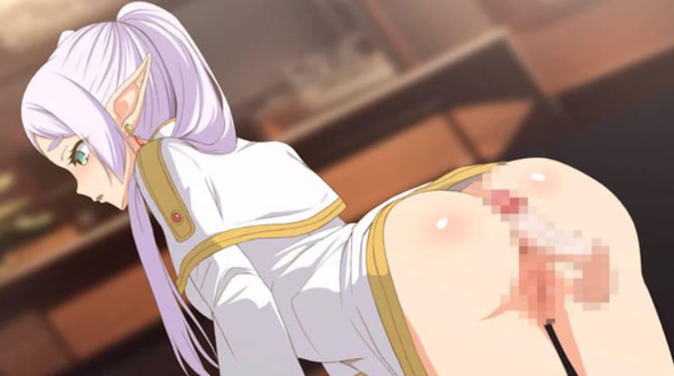
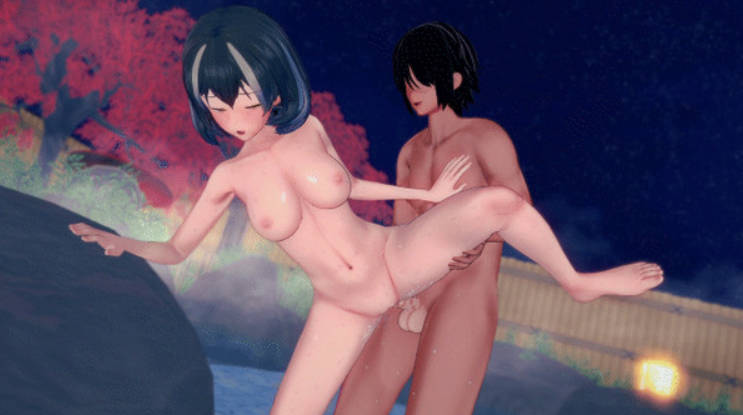
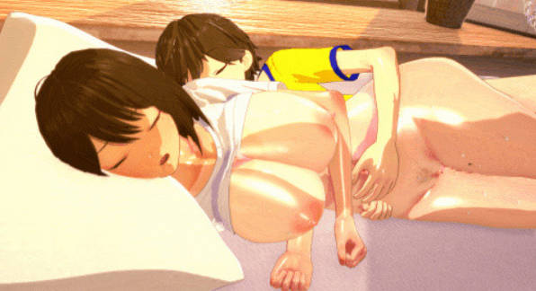
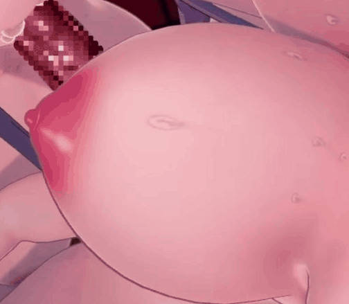

NSFW

# 动图转换为 GIF 时，色差和质量的一些研究和测试

有些动图（并非全部）转换为 GIF 之后，颜色偏差太多，有人提出了这个问题。

https://github.com/xuejianxianzun/PixivBatchDownloader/issues/399

提到的动图：https://www.pixiv.net/artworks/114246118

这个动图就是比较典型的，画面大量的色块，并且快速抖动，此时转换出的 gif 颜色经常失真。如果是比较复杂的画面，比如男女 sex 的动图，则不容易出现明显的失真。

在转换 gif 时，quality 是质量量化参数，默认值是 10，越小则质量越好，最低是 1。

```js
new GIF({
  workers: 4,
  quality: 10,  // 1 - 20
  workerScript: this.gifWorkerUrl,
})
```

之前是 10，我改成 1 试了试，对于上面的那个动图，确实色彩好了很多。并且图片体积没有明显增加。但是转换时间增加了。

如果设置为 1，那么对于原本就体积大，需要较长时间转换的动图来说，时间会变得更长。但实际上并不是所有动图都需要 1 这样好的质量。所以我做了一些调查，用质量 10 和 1 分别转换一些动图，比较它们的画质、生成的 gif 文件的体积、转换时间。

## 测试质量 10 和 1 的差别

测试的动图如下：
1. https://www.pixiv.net/artworks/114246118
2. https://www.pixiv.net/artworks/117685313
3. https://www.pixiv.net/artworks/117683380
4. https://www.pixiv.net/artworks/117686628
5. https://www.pixiv.net/artworks/117687615
6. https://www.pixiv.net/artworks/117684933

前三个都是体积较小，画面比较扁平（二次元）的风格。

第 4 个是 3D 的画面，但是上色比较像动画，没那么多细节。

第 5、6 个是恋活的 3D 做爱画面，画面细节较多。

### 1 问题明显

https://www.pixiv.net/artworks/114246118


原体积 224 KB，质量 10 存在多处明显色差，质量 1 则有明显改善，但右下角的灯棒依然有不正常的闪烁感。

转换耗时通过 console.time 输出，连测 4 次取平均值。下同。

| 质量 | 转换后体积 | 转换耗时 |
| ---- | ---------- | -------- |
| 10   | 328 KB     | 140 ms   |
| 1    | 334 KB     | 450 ms   |

质量 1 的耗时为质量 10 的 3 倍。

### 2 问题明显

https://www.pixiv.net/artworks/117685313


原体积 2.3 MB，质量 10 存在一处问题，妃咲头上蓝色的蝴蝶结发饰被光环分割成了上下两部分，质量 10 的时候，上半部分蝴蝶结不是蓝色而是灰色。质量 1 则是正常的蓝色。

| 质量 | 转换后体积 | 转换耗时 |
| ---- | ---------- | -------- |
| 10   | 3.92 MB    | 1200 ms  |
| 3    | 3.87 MB    | 2737 ms  |
| 1    | 3.84 MB    | 7957 ms  |

质量 1 的耗时为质量 10 的 6 - 7 倍。

### 3 没有问题

https://www.pixiv.net/artworks/117683380


原体积 5.6 MB，质量 10 没有明显的色差，大概因为它大部分画面都是静止的，只有眨眼睛和抖动头上的蝴蝶结。质量 1 看不出没什么变化。


| 质量 | 转换后体积 | 转换耗时 |
| ---- | ---------- | -------- |
| 10   | 8.43 MB    | 3100 ms  |
| 6    | 8.48 MB    | 4166 ms  |
| 1    | 8.35 MB    | 20130 ms |

质量 1 的耗时为质量 10 的 6 - 7 倍。

### 4 问题不明显

https://www.pixiv.net/artworks/117686628



原体积 7.2 MB，质量 10 也没有明显的色差，大概是因为画面运动不剧烈，而且风格是动漫风格的，是线条轮廓+上色的方式。

质量 1 在色彩断层上好些，即画面左下角和右上角的柜子、墙壁背景处，质量 10 的颜色断层比较明显，1 的好一些。但是在人物主体上没什么变化，毕竟是大面积纯色。

| 质量 | 转换后体积 | 转换耗时 |
| ---- | ---------- | -------- |
| 10   | 13.64 MB   | 3340 ms  |
| 8    | 13.59 MB   | 3680 ms  |
| 1    | 13.19 MB   | 16714 ms |

质量 1 的耗时为质量 10 的 5 - 6 倍。

### 5 问题不明显

https://www.pixiv.net/artworks/117687615



原体积 4.7 MB，质量 10 观感有些差，因为转换后画面的颗粒感比原图明显，而且右下角的黄色地灯的轮廓和边缘颜色都有些闪烁。

质量为 1 时，灯光的效果好了很多。颗粒感则还是差不多。

| 质量 | 转换后体积 | 转换耗时 |
| ---- | ---------- | -------- |
| 10   | 10.90 MB   | 1800 ms  |
| 5    | 10.78 MB   | 2453 ms  |
| 1    | 10.54 MB   | 7007 ms  |

质量 1 的耗时为质量 10 的约 4 倍。

### 6 没有问题

https://www.pixiv.net/artworks/117684933



原体积 21.7 MB，质量 10 没有明显的色差。质量 1 的画面没有明显提高。

| 质量 | 转换后体积 | 转换耗时 |
| ---- | ---------- | -------- |
| 10   | 41.07 MB   | 7000 ms  |
| 1    | 40.21 MB   | 27432 ms |

质量 1 的耗时为质量 10 的约 4 倍。

### 总结

质量 10 时，作品 1、2 存在明显问题，4、5 存在不太明显的问题，3、6 几乎看不出问题。

质量从 10 变成 1 对生成的 gif 图片体积几乎没有影响，有时体积反而还会缩小一些。差别在于画质和转换时间。

对于有问题的动图，质量 1 无疑是最好的，但花费的时间则是之前的 3 - 7 倍。当倍率太高时，花费的时间是令人难以忍受的。

我不能确定时间倍率的差别是什么原因导致的，但我猜测和图片分辨率有关，分辨率越高，提高质量所花费的时间倍率越高（仅是猜测）。

## 测试质量 6 和 3

我尝试在质量和转换时间中找到一个平衡。

在质量 10 和 1 之间取两个测试值：6 和 3，测试它们的画质和转换时间。

由于只有动图 1、2 存在明显问题，所以下面只测试它俩。

### 1

https://www.pixiv.net/artworks/114246118


- 质量 10：存在多处明显色差
- 质量 6：比质量 10 好些，但依然存在明显问题，比如舌头颜色暗淡，舔的那坨东西的颜色在褐色和灰色之间变化、以及灯棒在闪烁。
- 质量 3：比 6 又好一些，舌头的色差小了一些。舔的那坨的颜色稳定在灰褐色（但依旧不是原来的褐色）。灯棒倒是不闪烁了，这一点比 1 还好。
- 质量 1：没有明显色差，但右下角的灯棒依然有不正常的闪烁感。

| 质量 | 转换后体积 | 转换耗时 |
| ---- | ---------- | -------- |
| 10   | 328 KB     | 140 ms   |
| 6    | 322 KB     | 169 ms   |
| 3    | 326 KB     | 224 ms   |
| 1    | 334 KB     | 450 ms   |

### 2

https://www.pixiv.net/artworks/117685313


- 质量 10：存在一处问题，妃咲头上蓝色的蝴蝶结发饰被光环分割成了上下两部分，质量 10 的时候，上半部分蝴蝶结不是蓝色而是灰色。
- 质量 6：正常。
- 质量 3：正常。
- 质量 1：正常。

| 质量 | 转换后体积 | 转换耗时 |
| ---- | ---------- | -------- |
| 10   | 3.92 MB    | 1200 ms  |
| 6    | 3.87 MB    | 1663 ms  |
| 3    | 3.87 MB    | 2737 ms  |
| 1    | 3.84 MB    | 7957 ms  |

### 总结

由上可见，对于原本色差很严重的（作品 1），质量 1 才算能看。对于色差不严重的（作品 2），质量 6 就可以看了。

## 动态设置质量

基于以下前提：
1. 并非所有动图都会有色差
2. 下载器无法提前判断某个动图是否会有色差
3. 越高的质量转换所花费的时间越多

那么如何设置质量，尽量解决某些动图有色差的问题呢？

思路 1：我添加一个选项，让用户可以自己选择高质量还是低质量。但是这对于我（开发者）、用户来说都比较麻烦，我还得向用户解释这其中的差别，而且用户事先无法知道什么时候需要提前选择哪个选项。

思路 2：分析色差明显的图片的特征（即测试作品 1、2），发现它们都是手绘平涂风格的，而且出现色差的区域都是有快速的抖动的。这种动图的原体积不会很大（因为基本都是色块平涂），所以可以只对小于 3 MB 的动图使用质量 1。但这样也许会出现漏网之鱼，即大于 3 MB 的动图可能也需要使用较好的质量。

思路 3：尝试在质量和转换时间中找到一个平衡。在上面测试质量 3、6 就是这种思路。

思路 4：结合思路 2、3，根据文件体积来动态设置质量。暂定：

| 体积   | 质量 |
| ------ | ---- |
| < 1 MB | 1    |
| < 2 MB | 2    |
| < 3 MB | 3    |
| < 4 MB | 4    |
| < 5 MB | 5    |
| < 6 MB | 6    |
| < 7 MB | 7    |
| < 8 MB | 8    |
| < 9 MB | 9    |
| > 9 MB | 10   |

对于体积较小的动图，使用质量 1 来获得最好的画质。虽然这会大幅增加转换时间，但由于它们原本的转换时间只有一秒左右，所以用户体感上增加的时间并不多。

体积大的图片本身就需要转换很久，所以使用较低的质量，最低则是 10，和以前保持一致。

经过测试，效果还不错。

--------

质量 10 不仅对于某些小的动图不够用，对于大的动图也有可能不够用。例如：

https://www.pixiv.net/artworks/117692606

原图 36.9 MB，使用质量 10 转换为 GIF 之后，图片左侧的乳头有明显的颜色断层。



但是这没办法，因为如果使用更好的质量，转换会花费很长时间。

而且下载器压根无法知道一个动图是否需要更高质量。

我最喜欢 WEBM 格式，上面这个动图的 GIF 有 107 MB，但 WEBM 只有 18.7 MB，画质还好得多。
